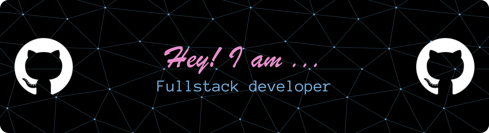

---

# 👋 Hey there, I'm Omm Prakash Sahoo  

💻 Fullstack Developer passionate about **building modern, scalable, and creative web apps.**  
🚀 Always exploring new technologies to make the web more interactive and powerful.  

---

## 🐱 About Me  

- 🌱 Currently learning **Next.js & Advanced Backend Development**  
- 🎯 Goal: To become a **Top-notch Fullstack Developer & Open Source Contributor**  
- 🎨 Love designing **creative UIs** with a futuristic vibe  
- 🌍 Based in **India**  
- ⚡ Fun fact: I debug my code faster with **coffee ☕ + music 🎧**  

---

## 🔥 Projects  

- 🌍 [**Travel Log Master**](https://github.com/Ommprakash9/travel-log-master) – A colorful travel journaling web app  
- ⛅ [**Weather Pro**](https://github.com/Ommprakash9/weather-app) – Real-time weather updates with a sleek UI  
- ✅ [**To-Do List**](https://github.com/Ommprakashsahoo1690/todo-list) – A modern responsive to-do app  

---

## 🌐 Connect with Me  

  
  
  

---

✨ *“Keep learning, keep building, keep growing.”*
